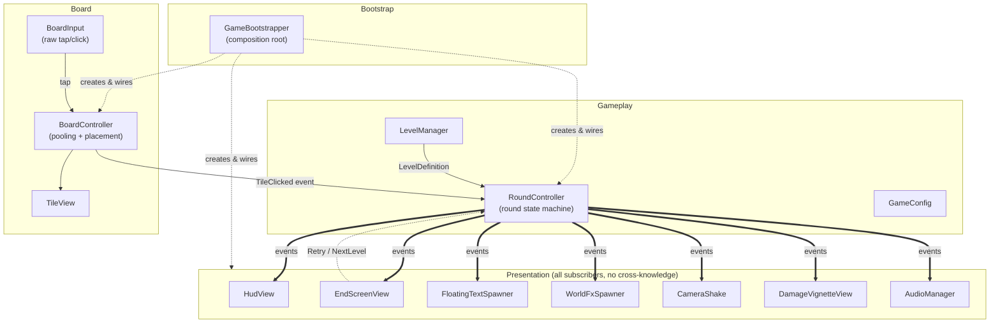
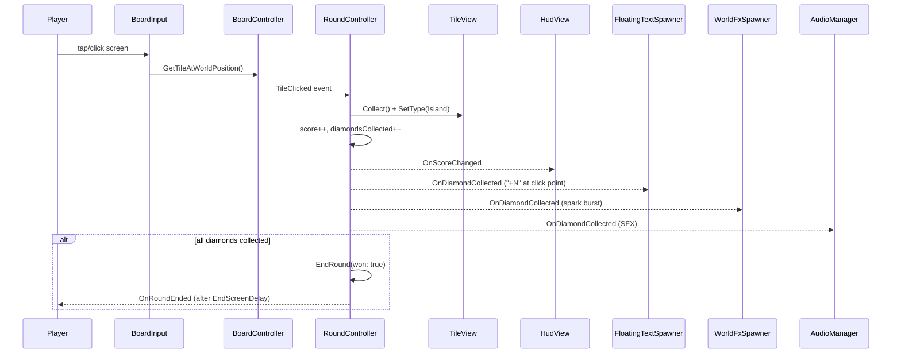

# Escape The Lava — Architecture

## What the game is

A 16×8 grid of tiles. Tap a **Diamond** to collect it and score, tap **Lava** to lose a life,
tap an **Island** and nothing happens. You have 30 seconds and 5 lives (both tunable). Collect
every diamond before the timer or your lives run out to win.

The project has two scenes: **Main Menu Scene** (a Start button that loads the game) and
**Game Scene** (everything described below).

## Architecture style

The codebase is event-driven and layered like a loose MVC:

- **`RoundController`** is the single source of truth for round state (timer, lives, score).
  It has **zero references to any UI, FX, or audio type** — it only knows about `BoardController`
  and `GameConfig`, and it broadcasts what happened through plain C# events.
- Every presentation system (`HudView`, `EndScreenView`, `FloatingTextSpawner`, `WorldFxSpawner`,
  `CameraShake`, `DamageVignetteView`, `AudioManager`) subscribes to those events. None of them
  know about each other, and `RoundController` doesn't know they exist.
- **`GameBootstrapper`** is the composition root — the *only* class that references every system
  by concrete type. It fetches/creates everything, calls each system's `Initialize()`, and wires
  every event subscription in one place (`WireEvents`).

This means you can delete or add a presentation system (say, a new screen-flash effect) by
subscribing to an existing `RoundController` event in `GameBootstrapper` — nothing about the
round logic itself has to change.

## Folder-by-folder

### `MainMenu/`
- **`MainMenuController`** — the Main Menu Scene's entire logic. Self-contained and unrelated to
  the event system below: it wires itself to a serialized `Button` reference in `Awake()`
  (`AddListener(PlayGame)`, unsubscribed in `OnDestroy()`), and `PlayGame()` just calls
  `SceneManager.LoadScene(gameSceneName)`. Both scenes must be listed in Build Settings for the
  load to succeed.

### `Bootstrap/`
- **`GameBootstrapper`** — entry point (`[DefaultExecutionOrder(-1000)]` so it initializes before
  anything that depends on it). `Start()` → `BuildGame()`:
  1. Resolve a `GameConfig` (assigned one, or `GameConfig.CreateRuntimeDefault()`).
  2. `FetchMissingReferences()` — auto-finds any unassigned dependency via
     `FindAnyObjectByType<T>()`; creates `AudioManager`/`LevelManager` GameObjects if truly missing.
  3. Initialize every subsystem.
  4. `WireEvents(config)` — every cross-system subscription lives here, nowhere else.
  5. `roundController.StartRound(levelManager.CurrentLevel)`.

### `Gameplay/`
- **`GameConfig`** *(ScriptableObject)* — every tunable in one place: grid size, tile size/gap,
  round duration (30s), starting lives (5), diamond score value, camera-shake feel, lava-flash
  duration/intensity, floating-text duration, end-screen delay, and random-generation
  ranges/densities.
- **`RoundController`** — the round state machine. `Update()` ticks `_remainingTime` while
  `RoundState.Playing` and ends the round on hitting zero. Subscribes to
  `BoardController.TileClicked`; routes each click by `tile.Type` to `CollectDiamond`, `HitLava`,
  or a "safe tap" branch. Broadcasts: `OnTimerUpdated`, `OnLivesChanged`, `OnScoreChanged`,
  `OnRoundStarted`, `OnRoundEnded`, `OnDiamondCollected`, `OnLavaHit`, `OnSafeTap`.
- **`RoundState`** — enum: `Booting, Playing, Won, Lost, Restarting`.
- **`RoundEndReason`** — enum: `AllDiamondsCollected, TimeExpired, LivesDepleted`.
- **`RoundResult`** *(readonly struct)* — the immutable snapshot (`Won`, `Reason`, `Score`,
  `DiamondsCollected`, `TotalDiamonds`, `TimeRemaining`) passed out via `OnRoundEnded`.
- **`LevelManager`** — owns progression. A hand-authored `progressionLevels[]` array plays
  sequentially; once it runs out — or if nothing was assigned at all — the game seamlessly falls
  into procedural generation instead of repeating a level. `randomMode` forces procedural
  generation from the start; the fallback kicks in automatically otherwise. Generated levels grow
  with level index but are always capped at the configured `randomMaxColumns`/`randomMaxRows` (not
  a hardcoded ceiling), and always guarantee ≥1 diamond so the level is winnable. `HasNextLevel()`
  is always `true` — there's either another curated level or a freshly generated one.

### `Board/`
- **`BoardController`** — builds/pools `TileView`s for a `LevelDefinition` and repositions them;
  `GetTileAtWorldPosition()` maps a world point back to a grid cell with pure math (no physics
  raycast). Tiles are pooled (`EnsurePool`) so switching levels reuses GameObjects instead of
  destroy/instantiate churn. Re-broadcasts clicks via `TileClicked`, gated by `AcceptsInput`.
- **`BoardInput`** — reads raw pointer/touch/mouse input (new Input System or legacy, behind
  compile guards), ignores taps over UI via `EventSystem.IsPointerOverGameObject`, and asks
  `BoardController` which tile was hit.
- **`TileView`** — the view for one cell: owns its base + icon `SpriteRenderer`s, a trigger
  `BoxCollider2D` (used only as input bounds, not physics), and a `TileAnimator`. `SetType()`
  is careful not to let a routine visual refresh cut off an in-flight `Collect()` fade animation.
- **`GridCoordinate`** *(readonly struct)* — `(Column, Row)`.
- **`TileType`** — enum: `Island, Lava, Diamond`.

### `Data/`
- **`LevelDefinition`** *(ScriptableObject)* — `columns`, `rows`, and a flat row-major
  `TileType[] tiles`. `GetTile`, `CountDiamonds`, `ValidateOrThrow` (dimension/length sanity check
  run by `BoardController.Build`), `Configure()` (used by `LevelManager`'s procedural generator and
  the editor tool below).

### `Editor/`
- **`LevelDefinitionEditor`** — a custom Inspector (`[CustomEditor(typeof(LevelDefinition))]`)
  that replaces raw-array/text editing with a paintable grid: pick a brush
  (Island/Lava/Diamond), click-drag across colored cells to paint, auto-detects a size mismatch
  and offers a one-click resize, shows a live diamond/lava count, and warns if zero diamonds are
  placed (unwinnable level). Lives in a folder literally named `Editor`, which Unity automatically
  excludes from player builds.

### `Visuals/`
- **`TileAnimator`** — per-tile idle *and* reactive animation. `Update()` branches on tile type:
  lava pulses scale and heats its color, diamonds bob and shine (only while the icon renderer is
  enabled), islands glow faintly. `TriggerImpactPulse()` / `TriggerSoftPulse()` layer a one-shot
  scale pulse on top for lava hits and safe taps respectively.

### `FX/`
- **`WorldFxSpawner`** — world-space particle bursts + expanding rings for diamond collect / lava
  hit / safe tap, using pooled `ParticleSystem`s and `SpriteRenderer` rings. The two burst
  gradients are built once in `Initialize()`, not allocated per-effect.

### `Camera/`
- **`CameraShake`** — additive positional shake with decaying amplitude; restores the camera's
  base local position when done.
- **`CameraFramingController`** — sizes/positions an orthographic camera to fit the current
  level's grid; re-applied on screen-size changes (cheap early-out check each `Update`).

### `Audio/`
- **`AudioManager`** — a pooled set of `AudioSource`s playing SFX via `PlayOneShot` (so rapid taps
  layer instead of cutting each other's clips off), one dedicated music source whose pitch ramps up
  as the timer runs low (`UpdateMusicPitch`, subscribed directly to
  `RoundController.OnTimerUpdated`). `winClips[]` / `loseClips[]` are arrays — `PlayWin()` /
  `PlayLose()` pick a random entry each time instead of always playing the same clip.

### `UI/`
- **`HudView`** — timer (color/scale pulse under 10s remaining), lives (heart icons cloned at
  runtime from a `heartTemplate` to match `GameConfig.startingLives`, pop/wobble animation on
  loss), and the score/diamonds text.
- **`EndScreenView`** — one win/loss screen, content differentiated by `RoundResult`, eased
  scale+fade-in on show. Exposes `RetryRequested` / `NextLevelRequested` back out to
  `GameBootstrapper`.
- **`FloatingTextSpawner`** — pooled floating `TextMeshProUGUI` popups spawned at the exact
  screen-space click position (rise + scale-pop + fade).
- **`DamageVignetteView`** — a full-screen red vignette that flashes at the screen edges on a
  lava hit, the UI-space counterpart to `CameraShake`. The radial-gradient texture is generated
  procedurally once in `Initialize()` (no art asset needed), then `Flash(duration, peakAlpha)`
  snaps to peak opacity and eases back to zero — same shape as `CameraShake.Shake()`.

## Round lifecycle, end to end

The same shape applies to lava (`HitLava` → `OnLavaHit` → floating "-1 Life", splash FX, camera
shake, red screen vignette, SFX) and to a safe tap (`OnSafeTap` → soft pulse + faint ring FX +
SFX, no state change).

## Event map (who listens to `RoundController`)

| Event | Subscribers |
|---|---|
| `OnTimerUpdated` | `HudView.SetTimer`, `AudioManager.UpdateMusicPitch` |
| `OnLivesChanged` | `HudView.SetLives` |
| `OnScoreChanged` | `HudView.SetScore` |
| `OnRoundStarted` | `AudioManager.PlayBackgroundMusic`, `EndScreenView.HideImmediate` |
| `OnRoundEnded` | `AudioManager.StopMusic`+`PlayWin`/`PlayLose`, `EndScreenView.Show` |
| `OnDiamondCollected` | `AudioManager.PlayDiamondCollect`, `FloatingTextSpawner.Spawn`, `WorldFxSpawner.PlayDiamondCollect` |
| `OnLavaHit` | `AudioManager.PlayLavaHit`, `FloatingTextSpawner.Spawn`, `WorldFxSpawner.PlayLavaHit`, `CameraShake.Shake`, `DamageVignetteView.Flash` |
| `OnSafeTap` | `AudioManager.PlaySafeTap`, `WorldFxSpawner.PlaySafeTap` |
| `EndScreenView.RetryRequested` | `RoundController.StartRound(currentLevel)` |
| `EndScreenView.NextLevelRequested` | `LevelManager.AdvanceLevel`, `HudView.SetLevelName`, `CameraFramingController.Initialize`, `RoundController.StartRound` |

All of the above wiring lives in exactly one place: `GameBootstrapper.WireEvents()`.

## Level authoring

- `GameConfig` sets the *default* grid size and round rules.
- `LevelDefinition` assets hold one level's actual tile layout, authored via the
  `LevelDefinitionEditor` grid-painter rather than editing arrays or strings by hand.
- `LevelManager` decides *which* `LevelDefinition` is active: a curated `progressionLevels[]`
  list, or `randomMode`'s on-the-fly procedural generation.
